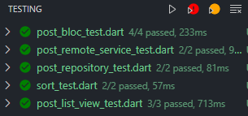

# 😁 About Me

Hi, I am Ken. I am working as a full-time Flutter developer at Foxconn. Currently, I am actively working on two projects that are fully written in Flutter. One is mobile and the other is a web application.

I hope everyone is doing well during the pandemic.😊

# ✨ About This Project

This project is fully sound Null-Safety. I create this project on flutter channel `dev`. However, flutter channel `stable` should also be fine.

You shouldn't need to run the build runner again. If you want to, run the below code in the CLI.

```dart
flutter pub run build_runner build --delete-conflicting-outputs
```

Build the project in an emulator as you usually do and you should be good to go!

# 🏠 Architecture

### Why I choose this architecture?

There are many architectures out there that are all fascinating. For example MVVM, MVC, MVP ... etc. The reason I am choosing the "Domain-Driven Design" architecture is this is the architecture that I find comfortable working with. It is easy to maintain and scale in the long run. There is no good or bad architecture, to be honest. There is the only architecture that you found easy to work with, easy to maintain, and most importantly works well with your project.

<br />

## Domain-Driven Design Architecture (DDD)

📢 Special shout out! This architecture is create by **Reso Coder**. The credits should go to **Reso Coder (Matt)**. If you want to learn more please check out his [YouTube](https://www.youtube.com/channel/UCSIvrn68cUk8CS8MbtBmBkA) channel there are more great resources to learn💪.

Lets first look at the big picture of the DDD architecture.


source: From **Reso Coder**

### Let's see how the finished project folder structure will look like first.


<br />

Here we can see the architecture can be separated into Presentation/Application/Infrastructure layer (from top to bottom). Each has its own responsibilities.

<br />

## <span style="color:#85C1E9">Presentation</span>

Presentation layer is where all the **Flutter Widgets** lived in along with the **state** of the widget.


<br />

## <span style="color:#F7DC6F">Application

The role of the Application layer is "_What to do next with the data?_". So this is where the business logic comes in and Yes! this is where the **BLoC** will live in. You will not find any **UI code, network request code, or database code here**. Very important.


<br />

## <span style="color:#F1948A">Domain

Domain layer is very special. It doesn't depend on any other layer. Meaning that if you change the backend service for example from AWS to Firebase or other services. This has nothing to do with the domain layer. Domain layer is where you

- Validate data from the infrastructure layer (backend or local service)
- Transform data
- Put the data into Entity classes that you used in your application.
- **Failure** union type (Kotlin) lived in. (p.s. you don't have to learn Kotlin to use this, but you will need to have a concept in What is a union?)

Handling the exception from REST API or any other services is a pain and will be complicated as your project grows. So making it into a custom **Failure** union class will make your life easier.


<br />

## <span style="color:#76D7C4">Infrastructure

Infrastructure layer is much like the presentation layer instead, it is at the bottom of the layer. This is where the remote service (REST API, Firebase ... etc) code will be. Also if your application has a local service such as [sqflite](https://pub.dev/packages/sqflite) ,[shared_preferences](https://pub.dev/packages/shared_preferences) package, or other database packages([moor](https://pub.dev/packages/moor), [hive](https://pub.dev/packages/hive) ...etc) this is where it will be

**Data Transfer Object** (DTO) whose purpose is to convert the raw data (dumb) between entities from the Domain layer and plain data from remote service and local service.

**Data sources** operate at the lowest level. Data from the outside world is mostly JSON format, especially from REST API. Its purpose is to convert JSON data to DTO. Here we will be using [json_serializable](https://pub.dev/packages/json_serializable) package to help us doing the `fromJson` and `toJson` functionalities. Through code generation([build_runner](https://pub.dev/packages/build_runner)), we do not have to write `fromJson` and `toJson` on our own. Thank god!

**Repository** is where you communicate between the outside world and domain. It returns either failure or success entity (converted from DTO) to the domain layer. Here I am using the Either<Failure, Entity>. Either is functional programming functionality provided from [dartz](https://pub.dev/packages/dartz) package.


<br />

# 📔 State Management

State management has always been a topic that had been continuing discussed a lot. Which is the best state management solution?

As the team, Very Good Ventures, that created Flutter BLoC package said

**_"The best state management solution is the one that works the best for you."_**

There are many [popular state management solutions](https://flutter.dev/docs/development/data-and-backend/state-mgmt/options) to choose from such as **redux**, **mobX**, **flutter_bloc**, and even classic **setState**.

[Provider](https://pub.dev/packages/provider) is also a popular one, which is created by Remi Rousselet. He recently also reinvented a new state management package call [Riverpod](https://pub.dev/packages/riverpod).

Classic Flutter stateful widget is usually enough for a simple application, for example, counter app. However, as your project grows larger and becomes more complicated. Putting all the business logic into the widget UI code will quickly make your code messy and hard to maintain. So many state management solutions come to the rescue.

Flutter BLoC is the package I used the most and like a lot. Here I will briefly discuss how BLoC works and some advantages and disadvantages.

<br />

##  BLoC (Business Logic Component)

Flutter BLoC is a library that implements BLoC Design Pattern. The BLoC Pattern has been designed by _Paolo Soares_ and _Cong Hui_, from Google and first presented during the DartConf 2018.

BLoC stands for Business Logic Component. It's a stream-based immutable state management. Widgets send events to the BLoC via Sinks, and widgets are notified by the BLoC via streams.

Ugh... Streams...😱 I know stream is scary. It's quite complicated and needs a lot of knowledge and practice to use it well.

However, stream is very powerful. The Very Good Ventures team manage to abstract the complexity of streams from developers. Developers do not need to maintain the complex subscriptions and lifecycles of stream, and instead, focus on the real, predictable interactions of your product.

However, you will still need to learn a few core concepts such as the Bloc API itself and the difference between a BlocBuilder and a BlocListener. More information and example check [here](https://bloclibrary.dev/#/gettingstarted)!

<br />


The above diagram shows us the overview of how bloc works. As we can see bloc communicates with UI through **Event** (from the user) and **State** (to the user).

### Advantage

- Simple, predictable, and testable
- Make state immutable
- State and event are independent from each other
- Utilize the power of Stream
- Follow the "Separation of Concern" practice
- Good tooling for VSCode, IntelliJ

### Disadvantage

- need to write a lot of boilerplate code

## Too complicated? Try Cubit


If you think writing a simple function with **bloc** is too complicated they have also created a widget called **cubit**. For more information check [here](https://pub.dev/packages/bloc#cubit)!

<br />

# 📦 Packages Used

I will briefly explain what the package does and why I use them. For more information, I recommend checking out the package. I have them link individually.

[flutter_bloc](https://pub.dev/packages/flutter_bloc): State management library that helps implement the BLoC design pattern

[bloc_test](https://pub.dev/packages/bloc_test): A package for testing BLoC.

[mocktail](https://pub.dev/packages/mocktail): A great testing package also create by **flutter_bloc** team (Very Good Ventures).

[freezed](https://pub.dev/packages/freezed): Great package for code generator for unions/pattern-matching/copy created by Remi Rousselet.

[dartz](https://pub.dev/packages/dartz): Provide functional programming in Dart.

[injectable](https://pub.dev/packages/injectable): Injectable is a convenient code generator for get_it package.

[get_it](https://pub.dev/packages/get_it): Service Locator for Dart and Flutter projects. With this, we can then use the Dependency injection(DI) pattern to inject all the dependencies into the classes that depend on it. As the project grows there will be more business logic involved. Dependency injection is a great way to keep your code clean, better organized, testable, and manageable.

[http](https://pub.dev/packages/http): Classic library for making HTTP requests. Another popular one is [Dio](https://pub.dev/packages/dio)

[json_serializable](https://pub.dev/packages/json_serializable): Provides Dart Build System builders for handling JSON. The builders generate code when they find members annotated with classes defined in [json_annotation](https://pub.dev/packages/json_annotation).

[build_runner](https://pub.dev/packages/build_runner): dart code generator that will generate code for json_serializable, injectable and freeze packages.

<br />

# 🧪 Testing

In this project, I provide tests include **Unit Test**, **Bloc Test**, and **Widget Test**. A brief introduction will be listed below. I will also provide some resources. Check if you want to know more.

<br />

## Unit Test

Definition:

- A function/method/variable in isolation
- Is a pure Dart test, no Flutter dependency

More information check [here](https://flutter.dev/docs/cookbook/testing/unit/introduction)!

Here I did the **postRemoteService**, **postRepository**, and **sort** functionalities unit test.

<br />

## Bloc Test

Test every state that the bloc might be emitting based on different events.

More information check [here](https://pub.dev/packages/bloc_test)!

<br />

## Widget Test

Testing a single UI Component. Make sure that every widget in your app is rendered as expected.

More information check [here](https://flutter.dev/docs/cookbook/testing/widget/introduction)!

<br />

## Test Result



Expanded:


# 📪 Contact Information

Email: ken22885@gmail.com

# 📚 Resources:

To learn more about clean architecture. Check out Uncle Bob's great [article](https://blog.cleancoder.com/uncle-bob/2012/08/13/the-clean-architecture.html).

Bloc library detail documentation: https://bloclibrary.dev/#/
